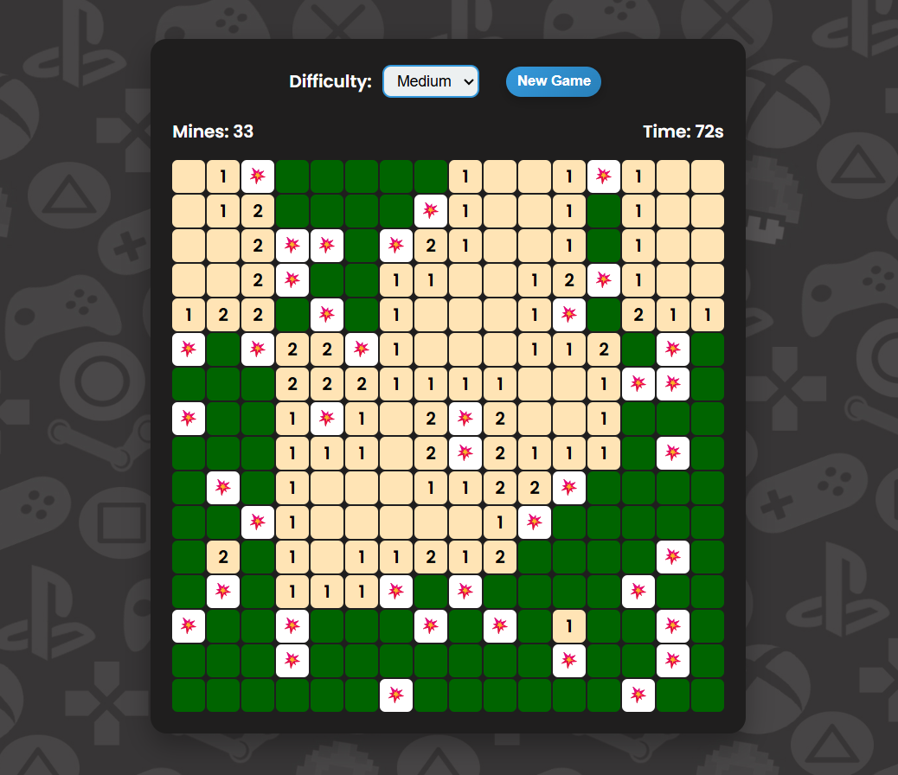

# Minesweeper Pro 🎮

🎮 **[Click here to play the Game](https://Prabhanjan-31.github.io/Minesweeper-Pro/)**  

An interactive **Minesweeper game** built with **HTML, CSS, and JavaScript**, featuring dynamic board generation, multiple difficulty levels, and engaging UI animations.

## 🚀 Features
- Dynamic board generation with scalable grid sizes  
- Recursive cell reveal algorithm for smooth gameplay  
- Flagging and real-time win/loss detection  
- Responsive UI with animations for enhanced user experience  
- Real-time timer ⏱️ and mine counter 💣  

## 🛠️ Tech Stack
- **HTML5** – structure  
- **CSS3** – styling, animations, responsiveness  
- **JavaScript (Vanilla)** – game logic, DOM manipulation, event handling  

## 📂 Project Structure
- Minesweeper-Pro/
  │── index.html # Main HTML file
  │── style.css # Styles and animations
  │── script.js # Game logic
  │── assets/ # images, icons, etc.

## 🎯 How to Play
1. Open `index.html` in your browser.  
2. Click on cells to reveal them.  
3. Right-click (or long-press on mobile) to flag suspected mines.  
4. Clear all safe cells to win the game. 🎉  

## 📸 Game Interface

## 🔮 Future Improvements
- Implement leaderboard with local storage  
- Add sound effects and themes
